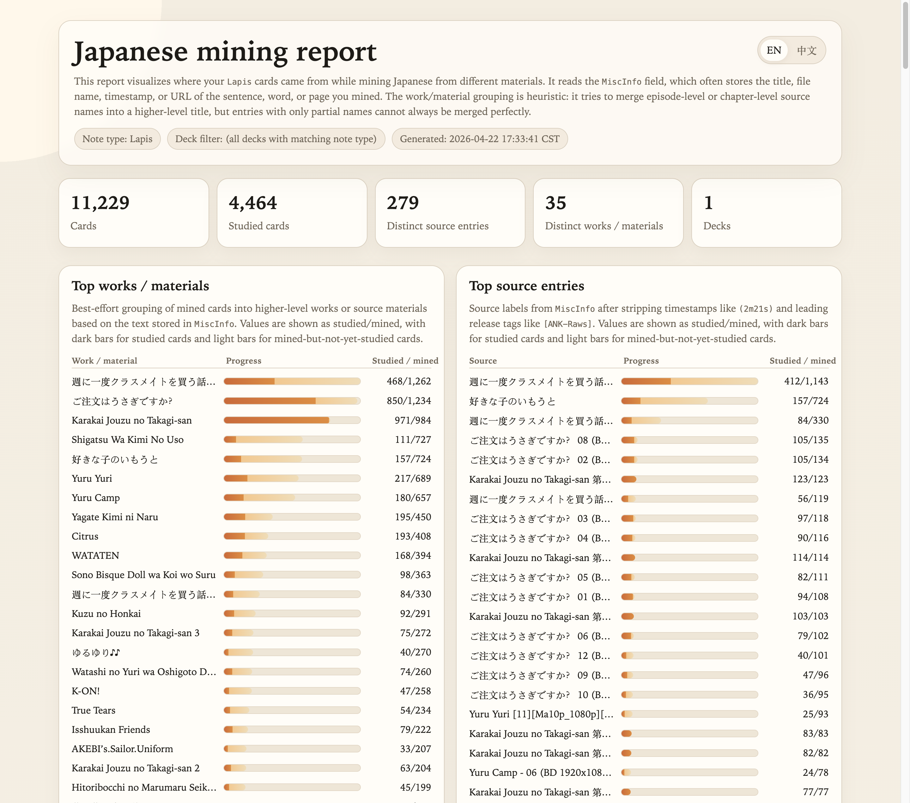

# Japanese Mining Report

Small script for visualizing where your Anki `Lapis` cards came from while mining Japanese.

It reads the `MiscInfo` field from your notes, groups mined cards by source and by higher-level work/material, and generates a local HTML report with English/Chinese UI switching.

## Preview



## Project Setup

This repository is managed as a `uv` project with a [`pyproject.toml`](pyproject.toml) and an installable CLI entrypoint.

Recommended setup:

```bash
uv sync
```

## What It Shows

- Total mined cards
- Studied cards
- Top works / materials
- Top source entries
- Full source table with filtering

For the two top charts:

- Dark bar segment: studied cards
- Light bar segment: mined but not yet studied cards
- Right-side value: `studied/mined`

## Safety

The script does **not** read Anki's live database directly.

Before querying anything, it copies `collection.anki2` and any matching `-wal` / `-shm` sidecar files to a temporary snapshot, then runs all analysis against that snapshot.

## Usage

Run from this directory:

```bash
uv run scripts/visualize_lapis_sources.py
```

Or run the packaged CLI from this repository:

```bash
uvx --from . japanese-mining-report --db "/path/to/collection.anki2"
```

Or directly from GitHub:

```bash
uvx --from git+https://github.com/L-M-Sherlock/japanese-mining-report.git \
  japanese-mining-report --db "/path/to/collection.anki2"
```

By default the script resolves the database in this order:

1. `--db /path/to/collection.anki2`
2. `ANKI_COLLECTION_PATH`
3. `./collection.anki2`

If you want to point at a specific collection:

```bash
uv run scripts/visualize_lapis_sources.py --db "/path/to/collection.anki2"
```

Or set an environment variable:

```bash
export ANKI_COLLECTION_PATH="/path/to/collection.anki2"
uv run scripts/visualize_lapis_sources.py
```

## Common Options

```bash
uv run scripts/visualize_lapis_sources.py \
  --note-type Lapis \
  --field MiscInfo \
  --deck-contains 日本語 \
  --top 30 \
  --output output/lapis_source_report.html
```

- `--db`: explicit path to the Anki collection database
- `ANKI_COLLECTION_PATH`: optional environment variable for the Anki collection database
- `--note-type`: note type name, default `Lapis`
- `--field`: source field name, default `MiscInfo`
- `--deck-contains`: optional deck-name substring filter
- `--top`: number of rows shown in the top charts
- `--output`: output HTML path

## Files in This Directory

- [pyproject.toml](pyproject.toml): project metadata for `uv`
- [scripts/__init__.py](scripts/__init__.py): package marker for the installable CLI
- [uv.lock](uv.lock): lockfile generated by `uv`
- [.python-version](.python-version): pinned Python minor version for `uv`
- [scripts/visualize_lapis_sources.py](scripts/visualize_lapis_sources.py): main script
- [output/](output): generated outputs
- [output/lapis_source_report.html](output/lapis_source_report.html): latest generated report

Generated files under `output/` and the local `.venv/` are ignored by git.
