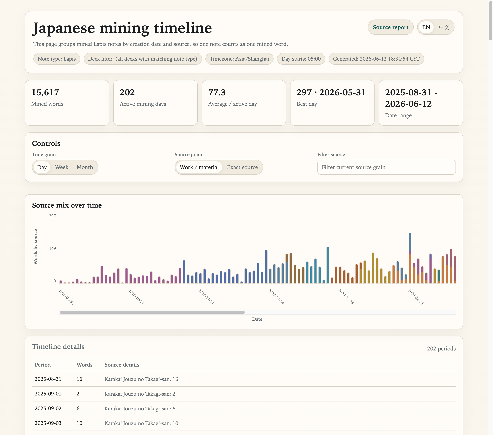

# Japanese Mining Report

Small script for visualizing where your Anki `Lapis` cards came from while mining Japanese.

It reads the `MiscInfo` field from your notes and generates two local HTML reports with English/Chinese UI switching:

- Source report: groups mined cards by source and higher-level work/material, and shows learning status such as studied cards and studied/mined percentages.
- Timeline report: groups mined words by note creation time and source, focusing only on mining/card-creation activity rather than study or review progress.

## Preview

### Source Report


### Timeline Report



## Project Setup

This repository is managed as a `uv` project with a [`pyproject.toml`](pyproject.toml) and an installable CLI entrypoint.

Recommended setup:

```bash
uv sync
```

## What It Shows

### Source Report

The source report is written to `output/lapis_source_report.html`. It answers where your mined cards came from and how much of that mined material has been studied.

- Total mined cards
- Studied cards and studied percentage
- Top works / materials, with studied/mined progress
- Top exact source entries, with studied/mined progress
- Full source table with filtering

For the source report top charts:

- Dark bar segment: studied cards
- Light bar segment: mined but not yet studied cards
- Right-side value: `studied/mined`

### Timeline Report

The timeline report is written to `output/lapis_mining_timeline_report.html`. It answers when you mined words and which sources they came from. It does **not** use review history or study status.

- Total mined words, active mining days, active-day average, best day, and date range
- Daily / weekly / monthly mining timeline
- Source mix over time by work/material or exact source
- Timeline details table grouped by period, with source details shown line by line
- Hover/focus explanations for summary metrics and chart segments

## Safety

The script does **not** read Anki's live database directly.

Before querying anything, it copies `collection.anki2` and any matching `-wal` / `-shm` sidecar files to a temporary snapshot, then runs all analysis against that snapshot.

## Usage

Run from this directory:

```bash
uv run scripts/visualize_lapis_sources.py
```

Or run the packaged CLI from this repository:

```bash
uvx --from . japanese-mining-report --db "/path/to/collection.anki2"
```

Or directly from GitHub:

```bash
uvx --from git+https://github.com/L-M-Sherlock/japanese-mining-report.git \
  japanese-mining-report --db "/path/to/collection.anki2"
```

By default the script resolves the database in this order:

1. `--db /path/to/collection.anki2`
2. `ANKI_COLLECTION_PATH`
3. `./collection.anki2`

If you want to point at a specific collection:

```bash
uv run scripts/visualize_lapis_sources.py --db "/path/to/collection.anki2"
```

Or set an environment variable:

```bash
export ANKI_COLLECTION_PATH="/path/to/collection.anki2"
uv run scripts/visualize_lapis_sources.py
```

## Common Options

```bash
uv run scripts/visualize_lapis_sources.py \
  --note-type Lapis \
  --field MiscInfo \
  --deck-contains 日本語 \
  --top 30 \
  --output output/lapis_source_report.html \
  --timeline-output output/lapis_mining_timeline_report.html \
  --timezone Asia/Shanghai
```

- `--db`: explicit path to the Anki collection database
- `ANKI_COLLECTION_PATH`: optional environment variable for the Anki collection database
- `--note-type`: note type name, default `Lapis`
- `--field`: source field name, default `MiscInfo`
- `--deck-contains`: optional deck-name substring filter
- `--top`: number of rows shown in the top charts
- `--output`: output HTML path
- `--timeline-output`: output HTML path for the mining timeline report
- `--timezone`: timezone used to group note creation dates, default system local timezone
- `--day-start-hour`: optional override for the hour when a mining day starts; by default this follows Anki's collection rollover setting, falling back to `4` if unavailable

The timeline report counts unique notes, not review events. For the default `Lapis` setup, one note corresponds to one mined word. Dates come from Anki note IDs, which are creation timestamps in milliseconds. Notes created before Anki's rollover hour are counted toward the previous mining day. Learning status is intentionally left to the source report.

## Publishing to GitHub Pages

You can opt in to publishing the generated reports to a profile-specific branch:

```bash
uv run scripts/visualize_lapis_sources.py \
  --db "$HOME/Library/Application Support/Anki2/JarrettYe/collection.anki2" \
  --publish-pages
```

By default this infers the Anki profile name from the parent directory of `collection.anki2`, then pushes a static site branch named `reports/<profile>`. For the example above, the branch is `reports/JarrettYe`.

The published branch contains only:

- `index.html`: a small landing page linking to both reports
- `lapis_source_report.html`
- `lapis_mining_timeline_report.html`

Publishing options:

- `--publish-pages`: enable the publish step after local report generation
- `--pages-remote`: git remote to push to, default `origin`
- `--pages-branch-prefix`: branch prefix, default `reports/`
- `--profile-name`: override the inferred profile name

One-time GitHub Pages setup:

1. Open the repository on GitHub.
2. Go to `Settings -> Pages`.
3. Set `Build and deployment` to `Deploy from a branch`.
4. Select the generated branch, for example `reports/JarrettYe`.
5. Select folder `/root`.

The report HTML contains your source names and mining statistics. If the repository is public, the published GitHub Pages site is public too.

## Files in This Directory

- [pyproject.toml](pyproject.toml): project metadata for `uv`
- [scripts/__init__.py](scripts/__init__.py): package marker for the installable CLI
- [uv.lock](uv.lock): lockfile generated by `uv`
- [.python-version](.python-version): pinned Python minor version for `uv`
- [scripts/visualize_lapis_sources.py](scripts/visualize_lapis_sources.py): main script
- [output/](output): generated outputs
- [output/lapis_source_report.html](output/lapis_source_report.html): latest generated report
- [output/lapis_mining_timeline_report.html](output/lapis_mining_timeline_report.html): latest generated mining timeline report

Generated files under `output/` and the local `.venv/` are ignored by git.
